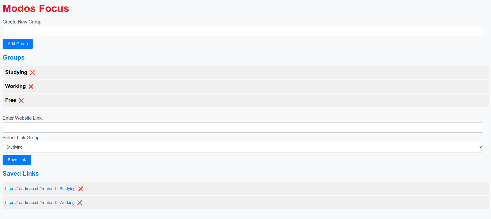

# Modos Focus
A chrome extension to help you improve your productivity.

### Demonstration[PT]: https://youtu.be/rS3RefVrd5k
### Video explaining the extension[PT]: https://www.youtube.com/watch?v=6B3vvc40yFk

## Extension Features
- You will create groups of profiles where you can decide which type of websites you cannot access within these groups.
- Create profiles, for example: Study, Work, Leisure, and Free.
- For each profile, we will list the blocked websites.
- When accessing these sites that are on the list, the extension should display a blocking message.

# Showcase
## Opening popup
You can click on the extension icon and this popup will open

## Options screen
This is the option screen

## Creating group
You can create new groups

## Deleting group
You can delete existing groups

## Saving links
You can save links and choose the group that blocks the link (blocklist)

## Deleting link
You can delete saved links from your blocklist

## Blocking website
Starting modo focus in the popup by clicking in "Play extension"

## Changing group
You can change the group you're in on the popup

## Pausing screen
You can pause the blocking in the screen button

## Pausing popup
You can pause the extension on the popup too

## How to use
You can download this repository in your computer and load in your chrome. Then you create groups and save links to them.

# Soon: Portuguese Readme and better video presentation